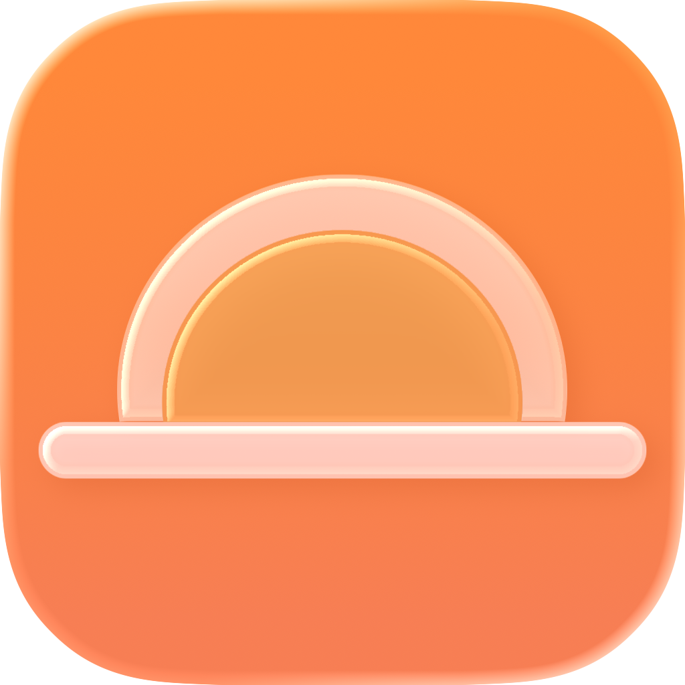
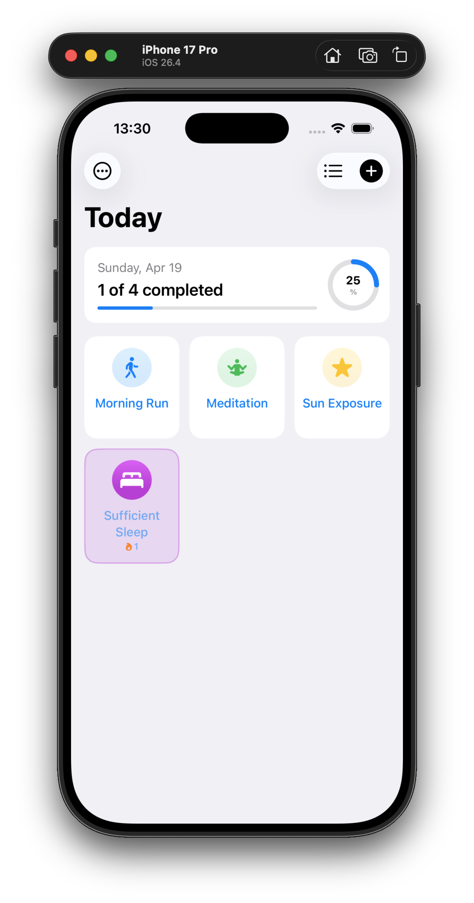
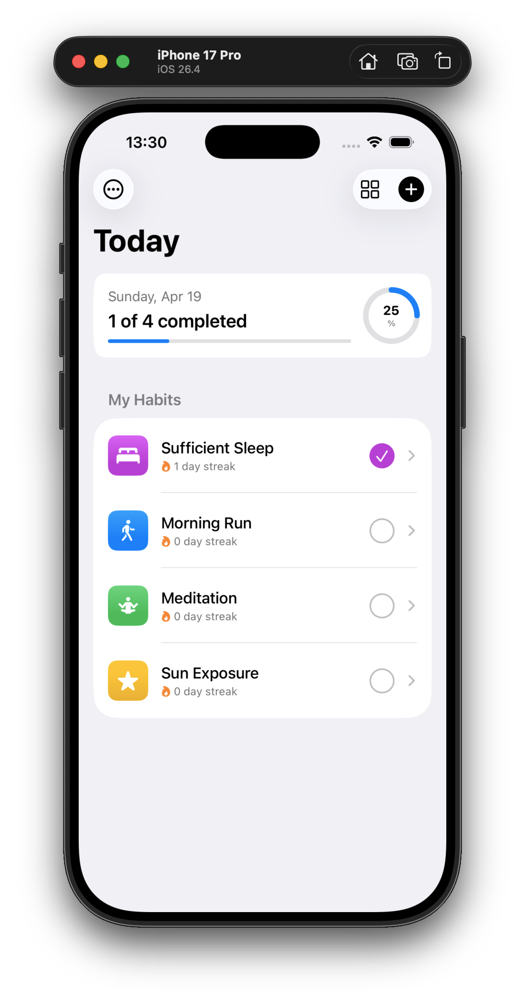
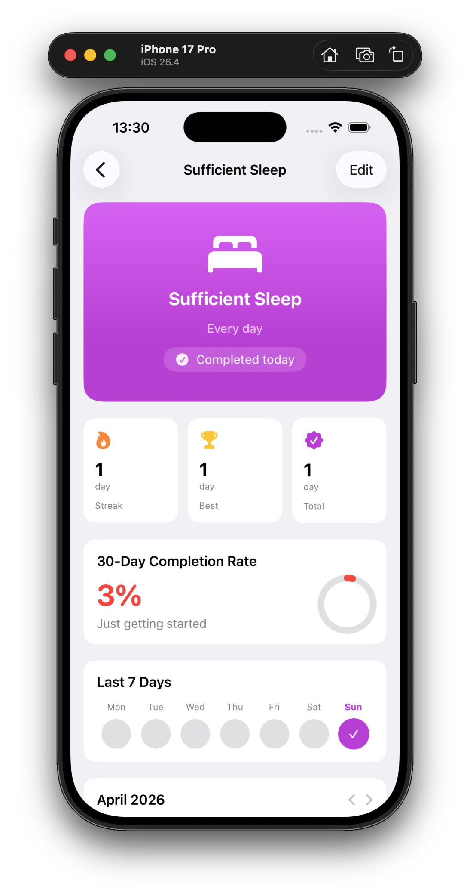
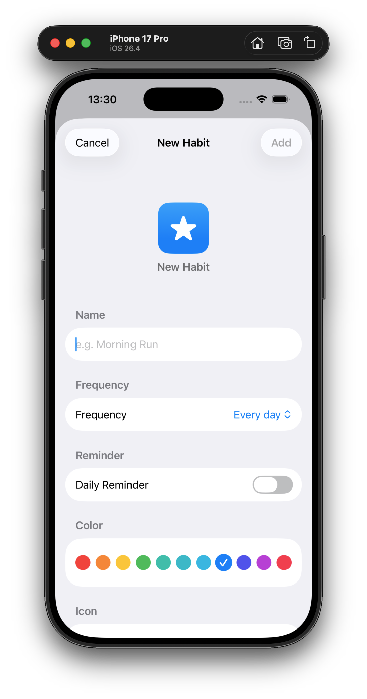
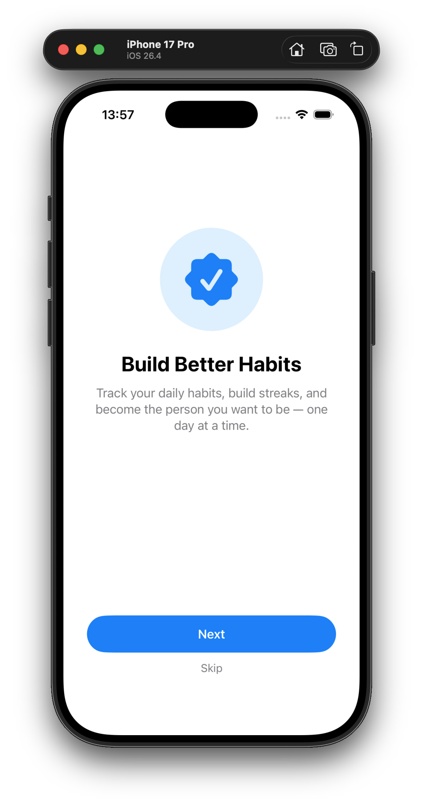
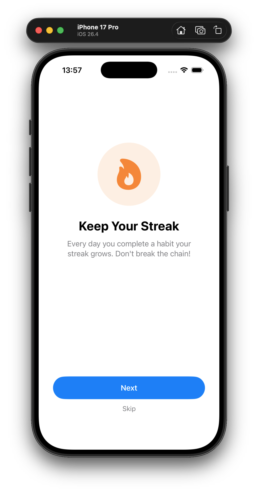
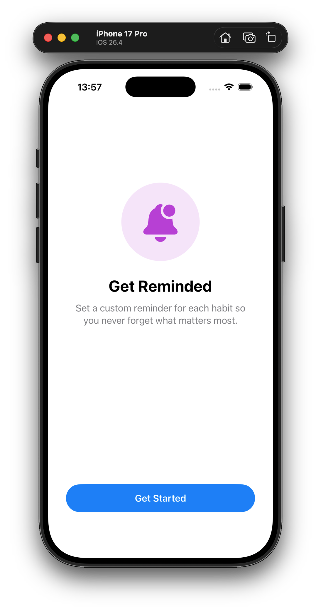
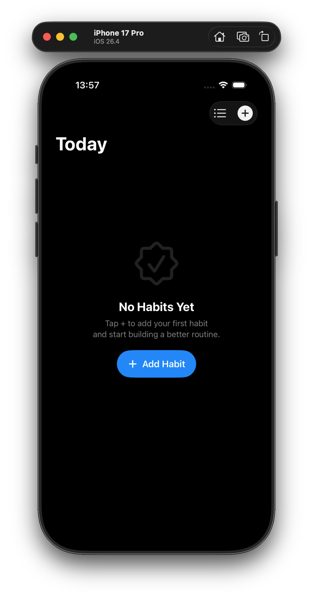

<p align="center">
  
</p>

# FreeHabits

A clean, native iOS habit tracker built entirely with **SwiftUI** and **SwiftData** — designed to feel like it came straight from Apple.

No subscriptions. No ads. No tracking. Just your habits.

<p align="center">
  
  
  
  
</p>

## Features

- **Grid & List View** — toggle between a compact card grid (like Shortcuts) and a classic list with swipe actions
- **Flexible Scheduling** — daily, weekdays, weekends, or a custom number of times per week
- **Streaks & Stats** — current streak, best streak, total completions, and a 30-day completion rate ring
- **Habit Detail** — full month calendar, 7-day overview strip, and a hero card with live status
- **Day Navigation** — swipe left and right to browse past days and review your history
- **Reminders** — set a custom daily reminder for each habit, plus an automatic evening nudge for incomplete habits
- **Archive** — shelve habits you want to pause without losing their history
- **Drag to Reorder** — arrange habits in the order that works for you
- **Dark Mode** — fully supported out of the box
- **Onboarding** — a friendly 3-page intro for first-time users

<p align="center">
  
  
  
  
</p>

## Tech Stack

| | |
|---|---|
| **UI** | SwiftUI |
| **Persistence** | SwiftData |
| **Notifications** | UserNotifications |
| **Minimum Target** | iOS 17 |
| **Dependencies** | None — 100% first-party frameworks |

## Project Structure

```
FreeHabits/
├── FreeHabitsApp.swift          # App entry point & ModelContainer setup
├── ContentView.swift            # Today screen (grid/list + day navigation)
├── Models/
│   ├── Habit.swift              # Main habit model
│   ├── HabitCompletion.swift    # Per-day completion record
│   ├── HabitFrequency.swift     # Daily / weekdays / N× per week
│   └── AppMigrationPlan.swift   # SwiftData schema versioning
├── Views/
│   ├── Today/
│   │   ├── HabitCardView.swift      # Grid card with tap-to-complete
│   │   ├── HabitRowView.swift       # List row with streak badge
│   │   └── ProgressHeaderView.swift # Daily progress ring
│   ├── HabitDetail/
│   │   ├── HabitDetailView.swift    # Full detail with stats & calendar
│   │   ├── MonthCalendarView.swift  # Pageable month grid
│   │   └── StatCard.swift           # Reusable stat card
│   ├── AddHabit/
│   │   └── AddHabitView.swift       # Create & edit habits
│   └── Onboarding/
│       └── OnboardingView.swift     # First-launch walkthrough
├── Services/
│   └── NotificationManager.swift    # Reminder & nudge scheduling
└── Extensions/
    └── Color+Habit.swift            # Color name → SwiftUI Color
```

## Getting Started

1. Clone the repo
2. Open `FreeHabits.xcodeproj` in Xcode 16+
3. Select your target device or simulator (iOS 17+)
4. Build & run

## License

This project is provided as-is for personal use.
